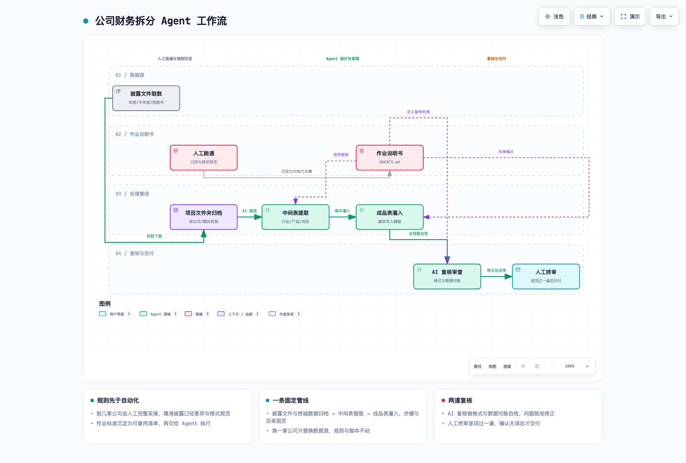

# 公司财务拆分 Agent 工作流

把「上市公司财务数据拆分」这件重复劳动，从逐页人工翻年报，变成一条 **Agent 可以照着执行的固定管线**：我说清楚这次要拆哪些数据，Agent 抓取 → 归档 → 提取 → 灌表 → 自检，我只做最终审核。



> 图为工作流总览；`assets/workflow.html` 是可交互版本（可切换明暗主题、搜索、聚焦、路径追踪与导出）。

---

## 它解决什么问题

做公司分析、写深度报告，第一步永远是**把披露文件里的财务数据拆成结构化表格**：按行业、按产品、按地区、按销量、按客户与供应商，还要按报告期铺开（年报 / 半年报），并且跨年口径对齐（产品改名、行业合并、申报稿与上市稿报告期不同）。

纯人工做一家公司：翻 10 年以上年报 PDF，逐表定位、换算单位、对齐口径、誊进 Excel，动辄一整天，且极易错位。

这套工作流做的事情是：**先把人工流程跑通、把规则写成说明书，再把流程交给 Agent 重复执行**。换一家公司，只替换数据源，规则和脚本不动。

## 应用场景

- **A 股 / 港股 / 日股 / 韩股 / 美股上市公司财务数据标准化拆分**
  按行业、按产品、按地区、按销量、按前五大客户与供应商、按费用科目，全部拆到标准化模板。
- **深度报告与公司分析的底稿生产**
  产出可直接引用的中间表与成品表，每个数据点都能回溯到披露文件的具体章节。
- **跨年口径对齐**
  产品改名链（旧名 → 新名）、行业合并与拆分（合并年 / 拆分年分别按原报告列示）、招股书申报稿与上市稿报告期差异、境外公司申报口径与本国不一致。
- **境外标的处理**
  结算货币不统一（韩元 / 日元 / 美元 / 新台币等）时按币种分别换算；境外披露分类与本国不一致时按当地口径重排；按需输出中英 / 中日对照版本。
- **多标的复用**
  同一套管线跑十家、二十家公司；新增标的只改配置不改逻辑。
- **Agent 工作流设计参考**
  一份可读的范例：如何把一个人工流程抽象成「作业说明书 + 固定管线 + 双重复核」的 Agent 可执行结构。

## 工作流四步

```
① 人工跑通与规则沉淀
   前几家公司由人工完整实操整轮拆分 → 摸清拆分口径、字段结构、格式规范、
   取数来源与校验要点，形成可复用的作业标准

② Agent 设计与实现
   把人工流程抽象成 Agent 可执行的固定管线，核心是编写 Agent Markdown 说明书
   （AGENTS.md）：写明每一步的取数范围、处理逻辑与输出规范

③ 数据处理流程设计
   数据收集：原始披露文件按大类归集为多套中间表格，并同步从金融终端（同花顺等）
             取数交由 AI 处理，统一存入项目文件夹
   数据提取：脚本从中间表写入最终成品表

④ 复核审查
   AI 复核：全链路自检，检查格式与数据内容并修正
   人工终审：逐项过一遍，确认无误后交付
```

## 仓库结构

```
.
├── README.md                      本文件：定位、应用场景、管线说明
├── AGENTS.md                      作业说明书模板（给 Agent 的执行规范，含占位符）
├── docs/
│   ├── pipeline.md                四步管线详述：目录约定、字段结构、过渡产物
│   └── pitfalls.md                通用踩坑清单（口径、单位、结构、工具层）
├── scripts/
│   ├── extract_common.py          文本表格解析 helpers（断行数字合并、标签清洗）
│   ├── make_blank_template.py     生成空白拆分模板
│   └── verify_output_format.py    成品表格式与交叉校验
├── templates/
│   └── 空白拆分模板.xlsx            A 列标签骨架 + 四行指标块
└── assets/
    ├── workflow.png               工作流总览图
    ├── workflow.html              可交互版本
    └── workflow.json              图形源文件（可改）
```

## 快速开始

```bash
git clone <this-repo>
cd company-financial-split-agent

# 1) 生成空白模板（或直接用 templates/ 里的版本）
python3 scripts/make_blank_template.py templates/空白拆分模板.xlsx

# 2) 按 AGENTS.md 的说明建立公司工作目录，放入披露文件
#    <公司>/statutory_filings/  年报、半年报、招股书
#    <公司>/data/               中间表
#    <公司>/outputs/            成品表

# 3) 成品表生成后跑格式与交叉校验
python3 scripts/verify_output_format.py <公司>/outputs/<公司>.xlsx
```

> 依赖：`python3` + `openpyxl`。解析 PDF 另需 `pymupdf`（或任意可提取文本层的工具）。

## 设计要点

1. **先有规则，再有自动化。** 没有人工跑通过一遍就交给 Agent，等于把错误批量复制。规则沉淀在说明里，Agent 只负责执行。
2. **中间表是核心资产，不是临时文件。** 提取结果先进中间表，成品表只从中间表读值灌入，脚本里不硬编码数字。任何一格都能回答「这个数从哪来」。
3. **交叉校验是哨兵。** 行业加总 ≈ 总收入、地区加总 ≈ 总收入、产品加总 ≈ 总收入；对不上先怀疑单位与口径，再怀疑数据。
4. **空值也是数据。** 披露未披露就留空并写明原因，不许填 0、不许推测、不许用别处数值顶替。
5. **模型只做它擅长的。** 长文档通读、结构化提取、脚本生成交给模型；口径判断、出处核对、最终交付由人负责。

## 质量闸与红线

- 每个数据点可回溯到披露文件的**具体章节**，不采信二次转述
- 全部计算由脚本执行，不让模型口算
- 无法核实的数据标注「未披露」，绝不编造
- 成品表格式（日期列、金额两位小数、百分比格式、空值规则）由 `verify_output_format.py` 机器校验
- 交付前人工终审逐项过一遍

## 许可

MIT License — 版权行见 `LICENSE`。仓库内不含任何真实公司披露文件、财务数据或个人信息，示例一律使用占位名称。
